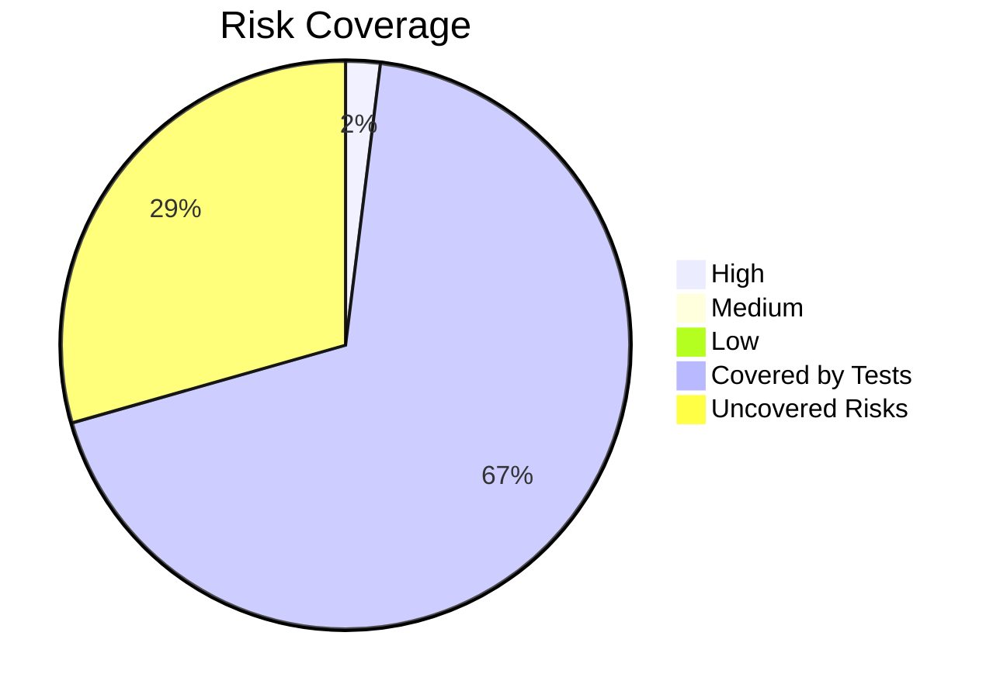

# ⚠️ CleanCity Risk Analysis

## Risk Table

| ID  | Feature        | Risk                         | Likelihood | Impact | Priority | Mitigation               |
| --- | -------------- | ---------------------------- | ---------- | ------ | -------- | ------------------------ |
| R1  | Home Form      | Date field doesn’t validate  | High       | High   | Critical | Add required field check |
| R2  | Dashboard      | Filtering shows wrong city   | Medium     | High   | High     | Verify filter logic      |
| R3  | Feedback Page  | Invalid Request ID accepted  | Medium     | Medium | Medium   | Add input validation     |
| R4  | Awareness Page | Missing image alt-text       | High       | Medium | Medium   | Add alt attributes       |

## Risk Coverage

